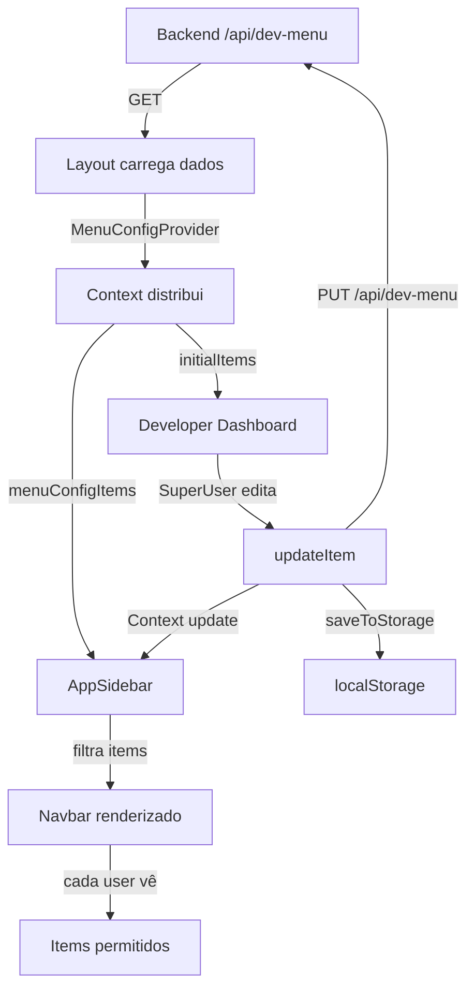

# Correção - Menu de Configuração do SuperUser

## 📋 Objetivo
Implementar e validar que:
1. ✅ Menu items carregam corretamente do backend
2. ✅ SuperUser pode configurar permissões (visibilidade + roles)
3. ✅ Alterações são persistidas no localStorage
4. ✅ Navbar filtra dinâmicamente baseado em configurações

---

## 🔄 Fluxo Completo

```
Backend (localhost:3001)
    ↓
    GET /api/dev-menu
    └─ Retorna:
       [
         {
           id: "dashboard",
           name: "Dashboard",
           enabled: true,
           pending: false,
           allowedRoles: ["COLABORADOR", "GESTOR", "ADMIN", "SUPER_USER"],
           description: "Visão geral do sistema"
         },
         {
           id: "financeiro",
           name: "Financeiro",
           enabled: true,
           pending: false,
           allowedRoles: ["GESTOR", "ADMIN", "SUPER_USER"],
           description: "Dados financeiros"
         },
         ...
       ]
    ↓
Layout (app/(dashboard)/layout.tsx)
    ├─ getSessionAccessToken(session)
    ├─ GET /api/dev-menu com token
    ├─ backendFetch("/api/dev-menu", { token })
    │  └─ [backendFetch] Token validado e aplicado
    ├─ Extrai menuConfig dos dados
    │  └─ [layout] Menu config carregado: {count, items}
    └─ MenuConfigProvider initialItems={menuConfig}
    ↓
MenuConfigProvider (components/super-usuario/menu-config-provider.tsx)
    ├─ Carrega do localStorage (se existir)
    │  └─ [MenuConfigProvider] Items carregados do localStorage: {count, items}
    ├─ Se vazio, usa initialItems do props
    │  └─ [MenuConfigProvider] Usando initialItems do props: {count, items}
    └─ Disponibiliza via Context
    ↓
DeveloperMenuEnhanced (components/super-usuario/developer-menu-enhanced.tsx)
    ├─ Acesso apenas para SUPER_USER ou admin@guimicell.com
    ├─ Exibe lista de menu items
    ├─ Para cada item:
    │  ├─ Estado: Hidden/Disabled/"Em Breve"/Enabled
    │  └─ Roles: Checkboxes para COLABORADOR, GESTOR, ADMIN, SUPER_USER
    │
    ├─ SuperUser clica "Salvar Alterações"
    ├─ API chamadas:
    │  └─ PUT /api/dev-menu/{itemId} com { enabled, pending }
    │     └─ [api-client] updateDevMenu chamado
    │
    ├─ localStorage atualizado
    │  └─ [MenuConfigProvider] Alterações salvas no localStorage
    │
    └─ Context notificado
       └─ AppSidebar recebe update via Context
    ↓
AppSidebar (components/layout/app-sidebar.tsx)
    ├─ Recebe menuConfigItems do Context
    │  └─ [AppSidebar] Menu config carregado: {count, items}
    │
    ├─ Filtra items com base em:
    │  ├─ isFeatureEnabled(featureId, userRole)
    │  ├─ canAccessMenuItem(menuConfig, userRole)
    │  └─ Regras especiais (ex: CONFIGURACOES só para ADMIN/SUPER_USER)
    │
    ├─ Logs de filtragem:
    │  ├─ [AppSidebar] {featureId} filtrado: feature flag desativado
    │  ├─ [AppSidebar] {featureId} filtrado: role {role} não permitido
    │  └─ [AppSidebar] Filtragem completa: {totalBefore, totalAfter, groups}
    │
    └─ Renderiza apenas items filtrados
    ↓
Resultado Final
    └─ Navbar mostra apenas items visíveis para o usuário
       └─ COLABORADOR vê: [Dashboard, Agenda, Colaboradores]
       └─ GESTOR vê: [Dashboard, Comercial, Financeiro, Agenda, Colaboradores]
       └─ ADMIN vê: [TUDO]
       └─ SUPER_USER vê: [TUDO + Developer Dashboard]
```

---

## ✅ O Que Foi Implementado

### 1. **Menu Config Context** (`lib/menu-config-context.ts`)

```typescript
✅ Tipo MenuConfigItem com:
   - id: string (identificador único)
   - name: string (nome legível)
   - description?: string
   - enabled: boolean (visível?)
   - pending: boolean ("em breve"?)
   - allowedRoles?: string[] (roles permitidos)

✅ localStorage persistência:
   - Key: "dev-menu-config"
   - saveMenuConfigToStorage(items)
   - loadMenuConfigFromStorage()
   - clearMenuConfigFromStorage()

✅ Context Type:
   - items: MenuConfigItem[]
   - setItems(newItems)
   - updateItem(id, updates)
   - saveToStorage()
   - loadFromStorage()
```

### 2. **Menu Config Provider** (`components/super-usuario/menu-config-provider.tsx`)

```typescript
✅ Carregamento ao montar:
   [MenuConfigProvider] Items carregados do localStorage
   [MenuConfigProvider] Usando initialItems do props

✅ Atualização de item:
   [MenuConfigProvider] Item atualizado: {id, changes, newState}

✅ Salvamento:
   [MenuConfigProvider] Alterações salvas no localStorage: {count, timestamp}
```

### 3. **Developer Menu Enhanced** (`components/super-usuario/developer-menu-enhanced.tsx`)

```typescript
✅ Acesso restrito:
   - Apenas SUPER_USER ou admin@guimicell.com

✅ UI States:
   - Hidden (vermelho): enabled=false
   - Em Breve (secundário): pending=true
   - Ativo (normal): enabled=true && !pending

✅ Role Checkboxes:
   - COLABORADOR
   - GESTOR
   - ADMIN
   - SUPER_USER

✅ Alterações rastreadas:
   - Card fica com border azul quando alterado
   - Badge "ALTERADO" aparece

✅ Ações:
   - Salvar Alterações (PUT /api/dev-menu/{itemId})
   - Restaurar (volta ao estado inicial)
```

### 4. **AppSidebar Filtragem** (`components/layout/app-sidebar.tsx`)

```typescript
✅ Menu config loaded:
   [AppSidebar] Menu config carregado: {count, items, userRole, isDeveloper}

✅ Item filtering:
   [AppSidebar] {featureId} filtrado: feature flag desativado
   [AppSidebar] {featureId} filtrado: role {role} não permitido

✅ Filtragem completa:
   [AppSidebar] Filtragem completa: {totalBefore, totalAfter, groups}

✅ Funções:
   - getMenuItemConfig(featureId): encontra config por feature ID
   - canAccessMenuItem(menuConfig, userRole): valida acesso
```

### 5. **Layout Inicial** (`app/(dashboard)/layout.tsx`)

```typescript
✅ Carregamento de menu config:
   const accessToken = getSessionAccessToken(session)
   const { response, data } = await backendFetch("/api/dev-menu", { token: accessToken })

✅ MenuConfigProvider wrapping:
   <MenuConfigProvider initialItems={menuConfig}>
     {children}
   </MenuConfigProvider>
```

---

## 🧪 Como Testar

### Teste 1: Acesso ao Developer Dashboard
```bash
1. Faça login como SUPER_USER ou admin@guimicell.com
2. Na sidebar, deve aparecer "Developer Dashboard" em "Desenvolvedor"
3. Clique em "Developer Dashboard" → vai para /super-usuario
4. Deve carregar lista de menu items
5. Se não carregar, verifique no console:
   - [backendFetch] Token validado (deve estar present)
   - [MenuConfigProvider] Items carregados (deve mostrar count)
   - [AppSidebar] Menu config carregado (deve mostrar items)
```

### Teste 2: Editar Visibilidade
```bash
1. No Developer Dashboard, encontre um item (ex: "Financeiro")
2. Clique no Select "Estado" e mude para:
   a) "Ocultar" → Card fica vermelho (hidden)
   b) "Em breve" → Card fica secundário (pending)
   c) "Ativo" → Card fica normal (enabled)
3. Card deve fica com border azul (ALTERADO)
4. Clique "Salvar Alterações"
5. Toast deve aparecer "Alterações salvas com sucesso!"
6. No console, procure:
   [MenuConfigProvider] Item atualizado: {id: "financeiro", changes, newState}
   [MenuConfigProvider] Alterações salvas no localStorage
```

### Teste 3: Editar Permissões (Roles)
```bash
1. No Developer Dashboard, encontre um item
2. Na seção "Visível para roles:"
3. Selecione apenas ["ADMIN"] (desmarque outros)
4. Clique "Salvar Alterações"
5. No console:
   [MenuConfigProvider] Item atualizado: {id, changes: {allowedRoles: ["ADMIN"]}}
```

### Teste 4: Persistência em localStorage
```bash
1. Faça alterações no menu (ex: restringir "Financeiro" para ADMIN)
2. Clique "Salvar Alterações"
3. Abra DevTools → Application → Local Storage
4. Procure por chave "dev-menu-config"
5. Deve conter JSON com itens configurados:
   {
     "financeiro": {
       "id": "financeiro",
       "enabled": true,
       "allowedRoles": ["ADMIN"]
     }
   }
6. Atualize a página (F5)
7. Configurações devem persistir
```

### Teste 5: Filtragem Dinâmica de Navbar
```bash
1. Como SUPER_USER, configure "Financeiro" para allowedRoles: ["ADMIN"]
2. Clique "Salvar Alterações"
3. Deslogue (Logout)
4. Logue como COLABORADOR
5. Vá para Dashboard
6. Na sidebar, "Financeiro" **NÃO DEVE APARECER**
7. No console, procure:
   [AppSidebar] financeiro filtrado: role COLABORADOR não permitido
8. Logue como ADMIN
9. Na sidebar, "Financeiro" **DEVE APARECER**
10. No console:
    [AppSidebar] Filtragem completa: {totalBefore, totalAfter}
```

### Teste 6: Restaurar ao Padrão
```bash
1. Faça alterações no menu
2. Clique "Restaurar"
3. Toast "Configurações restauradas" deve aparecer
4. No console:
   [MenuConfigProvider] Item restaurado
5. Items voltam ao estado inicial
```

---

## 📊 Estados do Menu Item

| Estado | enabled | pending | Aparência | Função |
|---|---|---|---|---|
| Ativo | true | false | Normal (verde) | Visível e funcional |
| Em Breve | true | true | Secundário | Visível mas desativado |
| Oculto | false | false | Vermelho | Não aparece no menu |

---

## 🔍 Troubleshooting

| Problema | Log para Procurar | Solução |
|---|---|---|
| Menu não carrega no /super-usuario | `[MenuConfigProvider] Nenhum menu config carregado` | Backend /api/dev-menu não respondeu |
| Items não aparecem na navbar | `[AppSidebar] Filtragem completa: totalAfter: 0` | Todos items foram filtrados |
| Alterações não salvam | `[api-client] 400 response` | Verificar payload enviado |
| localStorage vazio após salvar | `[MenuConfigProvider] Erro ao salvar` | Verificar espaço do localStorage |
| Role não aparece no contexto | `[AppSidebar] role {role} não permitido` | User não tem role configurado |
| Developer Dashboard não aparece | Sidebar não tem seção "Desenvolvedor" | User não é SUPER_USER |

---

## 📝 Fluxo de Implementação Completa



---

## ✅ Checklist de Validação

- [ ] Backend /api/dev-menu responde com lista de items
- [ ] Layout carrega e passa initialItems ao Provider
- [ ] MenuConfigProvider carrega do localStorage
- [ ] AppSidebar recebe menuConfigItems via Context
- [ ] SuperUser acessa /super-usuario
- [ ] SuperUser consegue alterar estado (Hidden/Pending/Enabled)
- [ ] SuperUser consegue alterar roles
- [ ] Alterações são salvas no backend (PUT /api/dev-menu/{id})
- [ ] localStorage persiste as alterações
- [ ] AppSidebar filtra items dinamicamente
- [ ] Diferentes roles veem diferentes menus
- [ ] Toast notifica sucesso/erro
- [ ] Console mostra logs detalhados

